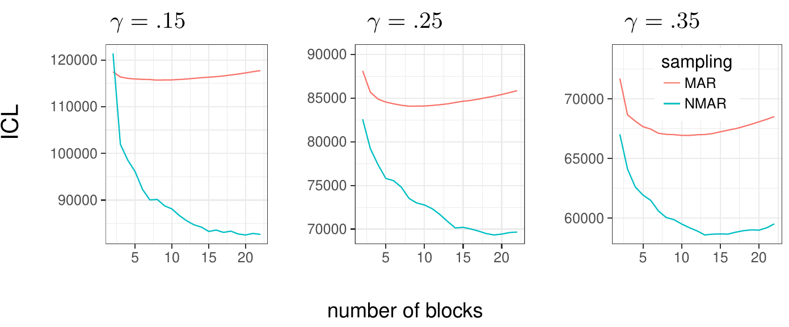
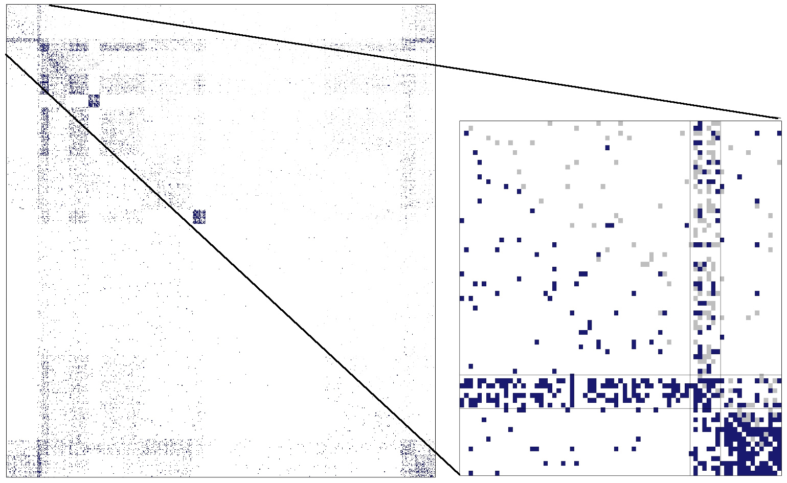
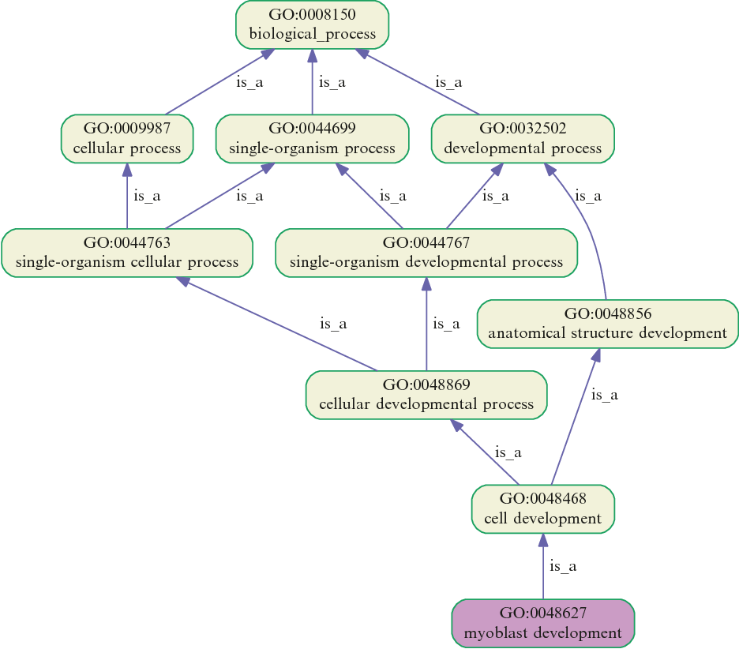

---

# Protein-Protein Network

### The data

- The PPI network in the neighborhood of ER composed by 741 proteins
- Valued dyads: $\omega_{ij} \in (0,1]$ reflecting the level of confidence in the interaction
-  Binarization of the network with a threshold $\gamma$:
$$\mathbf{Y}^\gamma = \left(Y^\gamma\right)_{ij} = \left\{
    \begin{array}{ll}
      1 & \text{if } \omega_{ij} > 1-\gamma, \\
      \texttt{NA} & \text{if } \gamma \leq \omega_{ij} \leq 1-\gamma, \\
      0 & \text{if } \omega_{ij} < \gamma. \\
    \end{array}
  \right.$$

### Questions

- What $\gamma$? 
- What sampling design: MAR or NMAR?

---

# Model Selection


```{r, echo = FALSE}

```

- The ICL criterion selects $\gamma = .35$ and MNAR sampling as the one that better fit the data
- Number of selected clusters: $11$ (MAR) and $13$ (NMAR)
- ARI between NMAR clustering and MAR clustering: $.39$
- MNAR clustering somehow coherent with gene ontology

---

# Imputation

```{r, echo = FALSE}

```
---

# Gene Ontology (GO)

Enrichment analysis *i.e.* identifying classes of genes over-represented in a large set of genes
MNAR founde $13$ significant biological process founded (MAR: only $1$)

```{r, echo = FALSE, fig.height=3}

```
